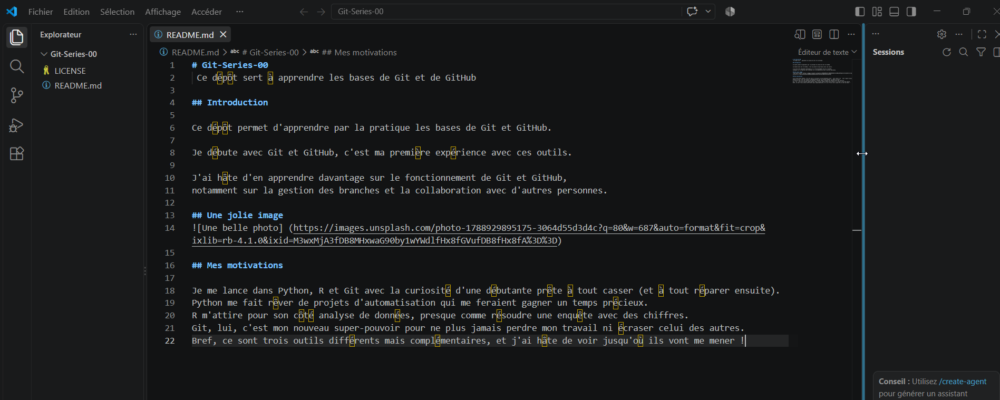

# Git-Series-00
 Ce dépôt sert à apprendre les bases de Git et de GitHub

## Introduction

Ce dépôt permet d'apprendre par la pratique les bases de Git et GitHub.

Je débute avec Git et GitHub, c'est ma première expérience avec ces outils.

J'ai hâte d'en apprendre davantage sur le fonctionnement de Git et GitHub, 
notamment sur la gestion des branches et la collaboration avec d'autres personnes.

## Une jolie image
![Une belle photo] (https://images.unsplash.com/photo-1788929895175-3064d55d3d4c?q=80&w=687&auto=format&fit=crop&ixlib=rb-4.1.0&ixid=M3wxMjA3fDB8MHxwaG90by1wYWdlfHx8fGVufDB8fHx8fA%3D%3D)

## Mes motivations

Je me lance dans Python, R et Git avec la curiosité d'une débutante prête à tout casser (et à tout réparer ensuite).
Python me fait rêver de projets d'automatisation qui me feraient gagner un temps précieux.
R m'attire pour son côté analyse de données, presque comme résoudre une enquête avec des chiffres.
Git, lui, c'est mon nouveau super-pouvoir pour ne plus jamais perdre mon travail ni écraser celui des autres.
Bref, ce sont trois outils différents mais complémentaires, et j'ai hâte de voir jusqu'où ils vont me mener !

## Ce que j'ai appris

Grâce à cet exercice, j'ai appris à utiliser Git et GitHub pour sauvegarder et partager mon code. 
J'ai appris à écrire un fichier README en Markdown, avec des titres et du texte. 
J'ai aussi appris à ajouter une image dans mon README en la plaçant dans un dossier "images", 
et en écrivant le bon chemin vers cette image pour qu'elle s'affiche correctement. 
Pour envoyer mes changements sur GitHub, j'ai utilisé GitHub Desktop : j'ai fait un "commit" (pour valider mes changements) puis un "push" (pour les envoyer en ligne).

Ce travail m'a pris environ 2 heures à réaliser.